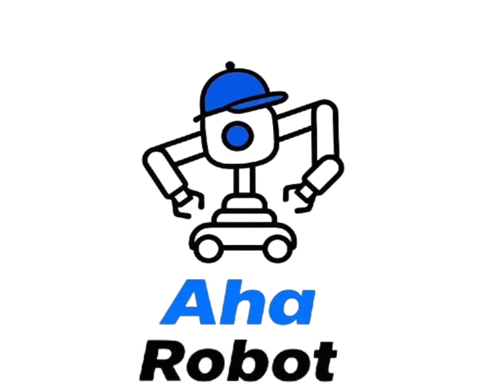

# ROS2 Workspace for AhaRobot

  

  <a href="https://aha-robot.github.io/" target="_blank">Project Website</a> • 
  <a href="https://arxiv.org/abs/2503.10070" target="_blank">Paper</a> • 
  <a href="https://www.notion.so/1b433900bc8780c4a503e3490ce3e718?pvs=21" target="_blank">Documentation</a> • 
  <a href="https://github.com/hilookas/astra_ws" target="_blank">ROS Code</a> •
  <a href="https://github.com/hilookas/AstraFirmwares" target="_blank">Firmware Code</a> •
  <a href="https://github.com/hilookas/Astra_Hardwares" target="_blank">Hardware Design</a> •
  <a href="https://huggingface.co/lookas" target="_blank">Dataset</a>

## Repository Contents

This repository is the ROS2 workspace for AhaRobot, organized into the following structure:

### ROS2 Packages (`src/`)

- **astra_controller**: The main part of the ROS workspace. This code communicates with the Firmware, routes ROS messages, performs inverse kinematics, and launches Web-based teleoperation
- **astra_description**: Robot URDF models and visualization configurations
- **astra_controller_interfaces**: Custom ROS message definitions
- **astra_moveit_config**: MoveIt configuration for motion planning (deprecated)
- **usb_cam**: Fork of `usb_cam`

### Non-ROS Components (`non_ros_src/`)

- **astra_teleop**: Core of RoboPilot teleoperation, including Python version of marker detection and Perspective-n-Point (PnP) pose computation
- **astra_teleop_web**: RoboPilot web-based teleoperation interface, WebAssembly version of marker detection
- **ModernRobotics**: IK solver
- **mr_urdf_loader**: Loading URDFs
- **lerobot**: Learning-based algorithms 
- **odrive-can**: ODrive CAN protocol library
- **urchin**: Fork of `urdfpy`
- **pyribbit**: Fork of `pyrender`

## How-to-use

For detailed documentation, please refer to our notion site:

<https://www.notion.so/aha-robot/Install-ROS-2-Workspace-1d733900bc8780ffa416e26b2d88f018>

## License

This project is licensed under the [GNU General Public License v3.0 (GPL-3.0)](https://www.gnu.org/licenses/gpl-3.0.en.html) with additional restrictions.

This means:
- ✅ You are free to use, modify and distribute the source code
- ✅ You must make your modifications available under the same license
- ✅ You must state changes made to the code
- ✅ You must include the original copyright notice
- ❌ You may not use the material for commercial purposes
- ❌ Modifications must also prohibit commercial use

IMPORTANT: This project explicitly prohibits ANY commercial use, including but not limited to selling products based on this project.

See the [LICENSE](LICENSE) file for the full license text.
